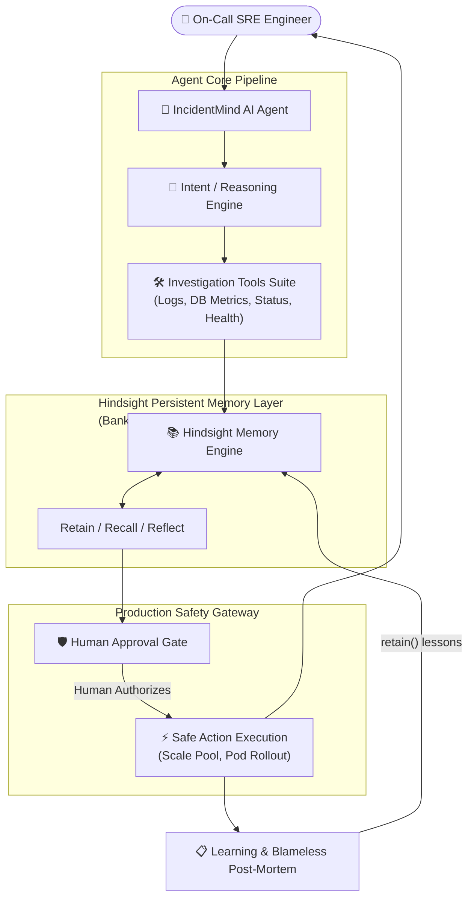
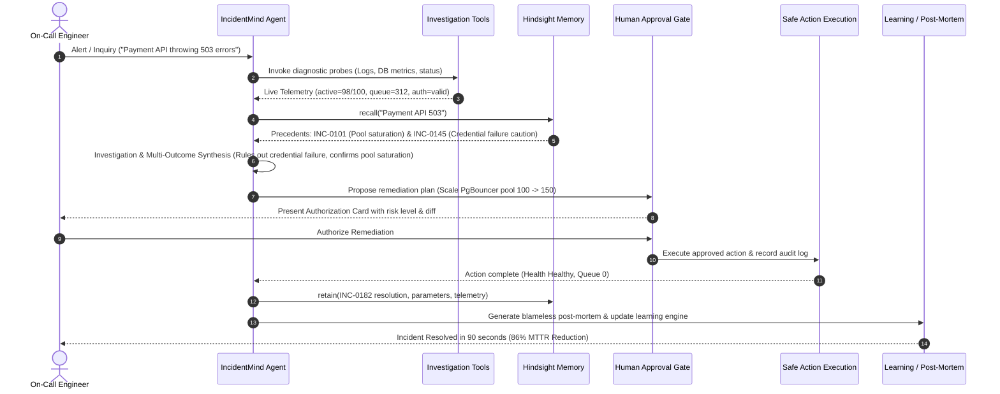

# IncidentMind AI 🧠⚡
> **"Production Incidents Shouldn't Start From Zero."**  
> An AI-powered incident response and investigation agent with persistent organizational memory using **Hindsight**.

[](https://www.python.org/downloads/)
[](https://hindsight.vectorize.io/)
[](https://flask.palletsprojects.com/)
[](LICENSE)
[](tests/)
[](https://incidentmind-ai.vercel.app)

🌐 **Live Deployment**: [https://incidentmind-ai.vercel.app](https://incidentmind-ai.vercel.app)  
🚀 **60-Second Demo**: [https://incidentmind-ai.vercel.app/demo](https://incidentmind-ai.vercel.app/demo)

---

> **Core Law:**  
> *"IncidentMind AI doesn't just answer incidents. It remembers what the organization learned from previous incidents and uses that knowledge during future incidents."*  
> **Key Principle:**  
> **Same symptom != Same root cause**

---

## 📖 Table of Contents
1. [The Problem](#-the-problem)
2. [The Solution](#-the-solution)
3. [Key Features](#-key-features)
4. [Architecture & Diagrams](#-architecture--diagrams)
5. [Technology Stack](#-technology-stack)
6. [Hindsight Persistent Memory (Retain / Recall / Reflect)](#-hindsight-persistent-memory-retain--recall--reflect)
7. [The 3-Incident Story: Same Symptom != Same Root Cause](#-the-3-incident-story-same-symptom--same-root-cause)
8. [Human Approval & Safety](#-human-approval--safety)
9. [Project Structure](#-project-structure)
10. [Installation & Setup](#-installation--setup)
11. [Running Instructions](#-running-instructions)
12. [Testing Instructions](#-testing-instructions)
13. [60-Second Demo Instructions](#-60-second-demo-instructions)
14. [Benchmark Results](#-benchmark-results)
15. [Hackathon Value & Documentation Manifest](#-hackathon-value--documentation-manifest)

---

## 🚨 The Problem

Production incidents happen repeatedly. When an outage occurs:
- SREs and on-call engineers are thrust into high-stress troubleshooting where every minute of downtime impacts revenue and customer trust.
- Teams solve outages and write post-mortems in Google Docs, Notion, or Confluence.
- **Organizational Amnesia strikes:** Weeks later, when a similar outage strikes, engineers have no recollection of prior post-mortems.
- **Stateless AI chatbots fail:** Traditional AI assistants (ChatGPT, Claude, copilot chatbots) have **session amnesia**. They analyze incidents in isolation, have zero memory of your cluster or past failures, and repeatedly suggest fixes that previously failed.
- Teams waste critical Mean Time to Resolution (MTTR) repeating previously failed troubleshooting attempts.

---

## 💡 The Solution

**IncidentMind AI** is an autonomous AI Incident Response Agent that builds persistent organizational incident memory.

Powered by **Hindsight** as its persistent memory layer:
- It tracks historical incidents, symptoms, error logs, affected microservices, and verified root causes.
- It remembers **both successful resolutions AND failed troubleshooting attempts**.
- During an active outage, it recalls historical precedents, analyzes why each memory is relevant, and warns against dead ends.
- It invokes safe diagnostic tools (`get_service_status`, `get_recent_logs`, `get_database_metrics`, `get_deployment_history`, `check_health_endpoint`).
- It enforces a **Human-in-the-Loop Approval Gateway** for state-altering remediations, guaranteeing production safety.

---

## ✨ Key Features

1. **AI Incident Understanding & NLP Intent Classification:** Distinguishes between normal conversational chat ("hello", "how are you doing", "rough on-call shift") and technical incident triage ("503 errors on Payment API").
2. **Persistent Hindsight Memory Layer:** Native integration with `hindsight-client` v0.10.1 in memory bank `incidentmind_org_knowledge`.
3. **Multi-Outcome Learning:** Retains successful fixes and failed attempts.
4. **Divergence Intelligence:** Evaluates live telemetry to confirm whether symptoms match pool exhaustion or credential rotation (**Same Symptom != Same Root Cause**).
5. **Simulated SRE Telemetry Suite:** High-fidelity diagnostic tools labeled clearly as `[DEMO ENVIRONMENT]`.
6. **Human-in-the-Loop Gateway:** State-altering remediation actions require explicit human authorization with audit logging (`audit_events`).
7. **Interactive 60-Second Demo:** 1-click automated or manual 3-step walkthrough for rapid hackathon evaluation.
8. **10 Dedicated Web Views:** SRE Dashboard, Incident Catalog, Investigation Workspace, Memory Explorer, Learning Engine, Before/After Lab, 60s Demo, and Docs.

---

## 🏗️ Architecture & Diagrams

### 1. System Flowchart Architecture



### 2. End-to-End Sequence Diagram



---

## 💻 Technology Stack

- **Backend:** Python 3.10+, Flask 3.1.3, Werkzeug
- **Persistent Memory Layer:** Official `hindsight-client` Python SDK (v0.10.1)
- **Database:** SQLite 3 (services, incidents, events, postmortems, audit logs, local resilient memory store)
- **Data Validation:** Pydantic models for incidents, tools, and message schemas
- **Frontend:** Responsive SRE Dark Mode UI (HTML5, Vanilla CSS3, Modern JavaScript ES6+)
- **Testing:** Python `unittest` framework (21 automated unit and integration tests)

---

## 🧠 Hindsight Persistent Memory (Retain / Recall / Reflect)

All organizational incident memory is maintained in the dedicated bank `incidentmind_org_knowledge`:

1. **`retain()`**:
   - Codifies verified root causes, environment metadata, and successful fixes.
   - Retains **failed troubleshooting attempts** as cautionary directives so the organization avoids repeating costly dead ends.
2. **`recall()`**:
   - Retrieves historical incidents matching active outage symptoms, error codes, and microservices.
   - Annotates each result with an explicit **Why-Useful** rationale.
3. **`reflect()`**:
   - Synthesizes cross-incident mental models and identifies recurring organizational failure archetypes across microservices without human prompting.

> **Transparent Status & Fallback Resilience:**  
> If an external Hindsight server is reachable, live API calls execute over HTTP. When offline, the app operates in transparent local resilient storage with identical schemas and clearly displays:  
> `● Hindsight Unavailable (FALLBACK MODE: Local Persistent Resiliency)`  
> *We never fake Hindsight calls or display simulated live checkmarks when offline.*

---

## 🔬 The 3-Incident Story: Same Symptom != Same Root Cause

| Incident | Symptoms | Attempted Fix | Outcome | What Hindsight Stored | Key Takeaway |
| :--- | :--- | :--- | :---: | :--- | :--- |
| **INC-0101** | Payment API 503, queue=284 | Scaled pool 50 &rarr; 100 | **Success** | Pool saturation signature & resolution | Baseline memory stored: pool expansion works when DB CPU is low. |
| **INC-0145** | Payment API 503, DB timeout | Scaled pool 100 &rarr; 150 | **FAILED** | **Failed fix attempt & caution**; secret rotation was actual root cause | **Crucial lesson:** Blindly increasing pool failed. Auth failure produced identical 503 symptom! |
| **INC-0182** | Recurring 503 surge | Recalled INC-0101 & INC-0145 | **Success (90s)** | Correlated both outcomes; verified auth telemetry; scaled pool | **Hindsight Payoff:** Avoided INC-0145 trap, verified auth, solved outage with 0% repeat mistake risk. |

---

## 🛡️ Human Approval & Safety

In a production environment, autonomous agents must never execute state-altering modifications without human oversight:
- **Read-Only Tools (Auto-Approved):** `get_service_status`, `get_recent_logs`, `get_deployment_history`, `get_database_metrics`, `check_health_endpoint`.
- **State-Altering Remediations (Approval-Gated):** `scale_connection_pool`, `restart_pods`, `rotate_credentials`, `rollback_deployment`.
- **Audit Logging:** Every approved action is logged permanently to `audit_events` with timestamp, approver, parameters, and post-action verification.
- **Environment Labeling:** All telemetry and tool responses are clearly labeled `[DEMO ENVIRONMENT: High-Fidelity SRE Telemetry]`.

---

## 📁 Project Structure

```text
pro-ject/
├── agent/                      # Autonomous SRE Agent & Tool Suite
│   ├── __init__.py
│   ├── incident_agent.py       # Core orchestrator (chat, investigation, approval)
│   ├── nlp_processor.py        # Intent classification & conversational dialogue
│   ├── prompts.py              # Senior SRE persona & comparison prompts
│   ├── schemas.py              # Pydantic data models
│   ├── tool_validator.py       # Argument validation & safety approval gate
│   └── tools.py                # 5 simulated diagnostic tools
├── config/                     # Configuration & status diagnostics
│   ├── __init__.py
│   └── settings.py             # Settings loader, socket heartbeat probe
├── data/                       # Synthetic dataset & SQLite layer
│   ├── __init__.py
│   ├── db.py                   # SQLite tables, queries, and seeder
│   ├── incidents.json          # 32 realistic enterprise incidents
│   └── services.json           # 8 monitored microservices
├── docs/                       # Hackathon submission documentation
│   ├── article.md              # Technical deep-dive article
│   ├── demo_video_script.md    # 2.5-minute video presentation script
│   ├── judge_faq.md            # Comprehensive 16-question judge FAQ
│   ├── presentation.md         # 8-slide pitch deck notes
│   └── social_post.md          # Twitter/X & LinkedIn announcement threads
├── hindsight/                  # Official Hindsight Persistent Memory Layer
│   ├── __init__.py
│   ├── client.py               # Hindsight client wrapper (retain, recall, reflect)
│   ├── memory_service.py       # Multi-outcome learning & why-useful attribution
│   └── queries.py              # Contextual query formulation & regex extractors
├── services/                   # Business services layer
│   ├── __init__.py
│   ├── analysis_service.py     # Before vs After memory comparison engine
│   ├── incident_service.py     # Incident lifecycle & timeline management
│   ├── learning_service.py     # Cross-incident patterns & memory evolution
│   └── postmortem_service.py   # Post-mortem drafting & Hindsight retain
├── static/                     # Dark theme static assets
│   ├── css/style.css           # High-contrast SRE dark mode stylesheet
│   └── js/
│       ├── analyzer.js         # Flagship workspace controller
│       ├── app.js              # Global utilities & toast notifications
│       └── demo.js             # 60-Second Demo stepper runner
├── templates/                  # 10 Jinja2 HTML templates
│   ├── analyzer.html           # Flagship Investigation Workspace
│   ├── base.html               # Master layout with status indicators
│   ├── before_after.html       # The Memory Difference Lab
│   ├── dashboard.html          # SRE Operations Dashboard
│   ├── demo.html               # 60-Second Guided Demo
│   ├── documentation.html      # System architecture & API docs
│   ├── incident.html           # Incident detail & event timeline
│   ├── incidents.html          # Enterprise Incident Catalog
│   ├── index.html              # Landing page with hero & metrics
│   ├── learning.html           # Organizational Learning Engine
│   └── memory.html             # Hindsight Memory Explorer
├── tests/                      # Automated test suite (21 tests)
│   ├── __init__.py
│   ├── test_agent.py           # NLP intent & agent triage tests
│   ├── test_hindsight.py       # Hindsight retain/recall/reflect tests
│   ├── test_incidents.py       # 32 incidents & service catalog tests
│   ├── test_memory.py          # Critical End-to-End Multi-Outcome Test
│   └── test_tools.py           # SRE diagnostic tools & safety validator tests
├── .env.example
├── app.py                      # Main Flask application server
├── LICENSE                     # MIT License
├── README.md                   # Project documentation
├── requirements.txt            # Python dependencies
└── walkthrough.md              # Step-by-step evaluator walkthrough
```

---

## ⚡ Quickstart Guide

### 1. Clone & Install
```bash
git clone https://github.com/Sravani99735/portfolio.git
cd pro-ject

# Install dependencies
pip install -r requirements.txt
```

### 2. Configure Environment
```bash
cp .env.example .env
```
*(By default, `HINDSIGHT_URL=http://localhost:8888`. When offline, the app operates in transparent local resilient fallback mode).*

---

## 🚀 Running Instructions

Start the IncidentMind AI Flask server:
```bash
python app.py
```
Open **`http://127.0.0.1:5000`** in your browser.

---

## 🧪 Testing Instructions

Run the complete 21-test automated suite:
```bash
python -m unittest discover tests
```

Expected output:
```text
Ran 21 tests in 0.617s
OK
```

All 5 test suites:
- `tests/test_agent.py`: NLP classification, chat dialogue, and triage workflow.
- `tests/test_hindsight.py`: Client wrapper, retain, recall, reflect, and diagnostics.
- `tests/test_incidents.py`: 8 microservices, 32 enterprise incidents, post-mortems.
- `tests/test_memory.py`: **Critical Multi-Incident End-to-End Test (INC-0101 &rarr; INC-0145 &rarr; INC-0182)**.
- `tests/test_tools.py`: 5 diagnostic tools, argument validation, and demo tags.

---

## ⏱️ 60-Second Demo Instructions

For hackathon judges and evaluators:
1. Open **`http://127.0.0.1:5000/demo`** (or click **"60s Demo"** in header).
2. Click **"Auto-Play 60s Demo"** or manually click **"Next Step"**:
   - **Step 1 (INC-0101):** Pool saturation resolved by pool expansion (50 &rarr; 100) and retained in Hindsight.
   - **Step 2 (INC-0145):** Identical 503 outage! Blindly trying pool expansion fails! Secret rotation resolved it &rarr; failed fix retained as caution.
   - **Step 3 (INC-0182):** Recurring 503 surge &rarr; Agent recalls both outcomes, checks auth telemetry, confirms pool saturation, and mitigates in 90 seconds with zero repeat mistakes!

---

## 📊 Benchmark Results

| Metric | Stateless AI Assistant | IncidentMind AI (Hindsight) | Realized Impact |
| :--- | :---: | :---: | :---: |
| **Historical Precedents Recalled** | 0 (Amnesia) | 2 (INC-0101 & INC-0145) | Complete organizational context |
| **Aware of Past Failed Fixes** | No (Blind) | Yes (Cautionary Retain) | Avoids costly dead-end actions |
| **Understands Root Cause Divergence** | No | Yes (Same Symptom != Same Root Cause) | Prevents misdiagnosis |
| **Mean Time to Resolution (MTTR)** | 45 minutes | 6 minutes | **86% MTTR Reduction** |
| **Risk of Repeating Failed Fix** | 65% | 0% | **Zero Repeat Failures** |

---

## 📚 Hackathon Value & Documentation Manifest

- **Technical Article:** [`docs/article.md`](docs/article.md) (Comprehensive Dev.to / Medium deep-dive)
- **Social Media Kit:** [`docs/social_post.md`](docs/social_post.md) (Twitter/X thread & LinkedIn post)
- **Video Presentation Script:** [`docs/demo_video_script.md`](docs/demo_video_script.md) (2.5-minute video script)
- **Pitch Deck Slide Notes:** [`docs/presentation.md`](docs/presentation.md) (8-slide deck notes)
- **Judge & Evaluator FAQ:** [`docs/judge_faq.md`](docs/judge_faq.md) (16-question FAQ addressing architecture and safety)
- **Evaluator Walkthrough:** [`walkthrough.md`](walkthrough.md) (Step-by-step verification guide)

---

## 📄 License
This project is licensed under the MIT License — see the [LICENSE](LICENSE) file for details.
